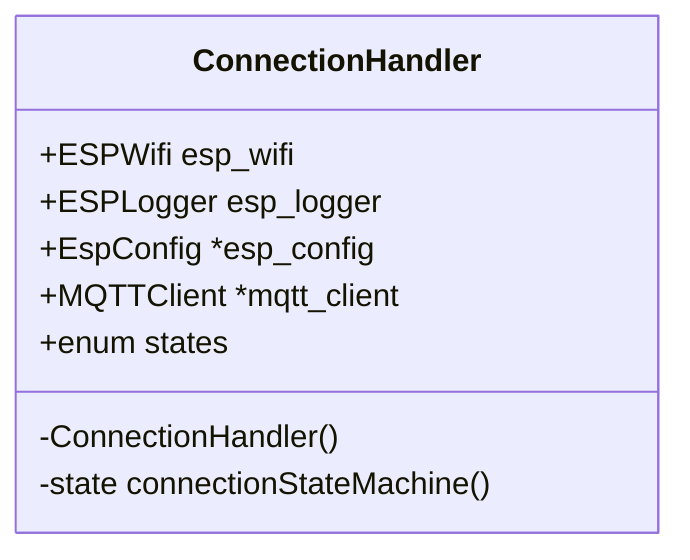

# Class - ConnectionHandler
The purpose of this class is to ensure that every remote connection is alive and maintained (Wifi, MQTT to broker).

## Features

The main structure contains a state machine which handles the connection to the Wifi, sets up a TLS client for MQTT, enables a connection to the AWS MQTT Broker.

# Structure

Basic UML in order to understand the structure of the class 

