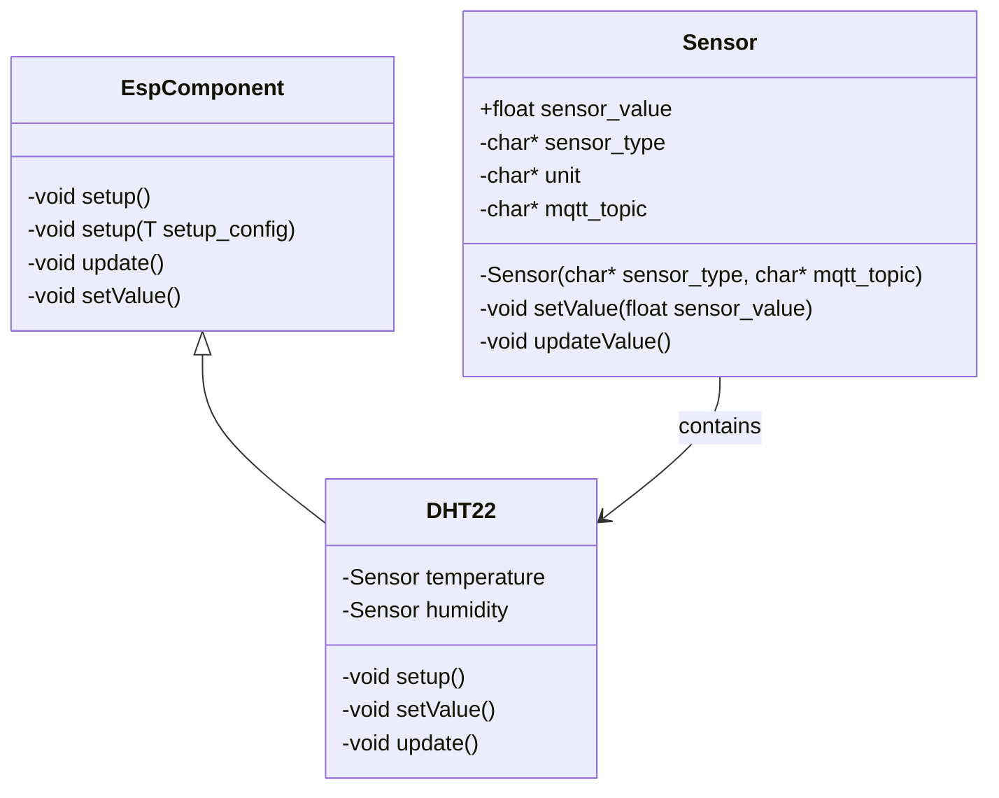

# Structure for implementing Sensor Modules

A sensor module is a a type of measuring device which can be attached to the **ESP32** via a serial connection (I2C, 1WIRE). The sensors of the module measures physical quantities like temperature or humidity, etc. In order to get a general form for adding new sensor modules to the framework the following points should be taken into account:

- A newly written class for a sensor module should always implement the `EspComponent` superclass. That is necessary to ensure a general structure when calling the new sensor modules object.
- The measured physical values which can be read of the sensor should be fed into a new instance of the `sensor` class.

## Structure

Basic UML in order to understand the structure. The implemented sensor module `DHT22` is just an example.

